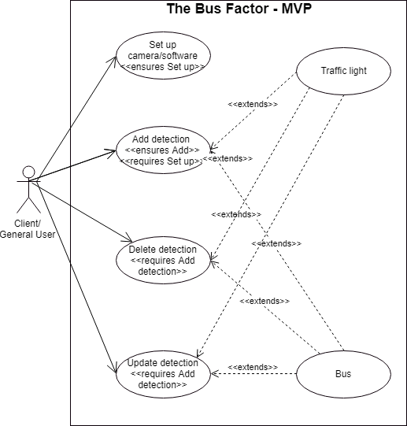

# ENGR 301 Project *11* Proposal and Requirements Document
#### Brandon Scott-Hill, Dylan Kumar, James Magallanes, Kristen Tait, Nicholas Snellgrove, Sean Stevenson

## 1 - Introduction

### Client

The clients for this project are Hugh and Stephen from ZX Security.
Contact Details:

Stephen Shkardoon: stephen@zxsecurity.co.nz  
Hugh Davenport: hugh@zxsecurity.co.nz  

### 1.1 - Purpose

The system must take a video input from any standard webcam, and from this input - detect when a bus is seen running a red light & report to the user in real-time.

### 1.2 - Scope

The Bus Factor Project will produce a program which can be set up and run on any consumer-available computer, using a commercially available webcam.
The program should be able to run on both Windows and Linux devices and work when set up at any intersection, from any angle.
The program will take in a video input. It will then automatically detect the location & status of the red light
in the video, and automatically detect when a bus runs the detected red light. To do this, the state of the light 
must be automatically detected, and the boundary point for the intersection
(I.e. the line not to be crossed by the bus) should be either manually inputted or automatically detected.
When an offence is detected, the program should automatically trigger some sort of event to notify the user - 
either a pre-programmed event or some other user-defined code.
Then, a short video clip of the offence should be saved, showing time before and after the offence. 
Extra potential features could include Licence Plate Detection, OBS Integration, Speed Detection of offending vehicles, Reporting events to local Traffic Authorities, 
or prediction/statistics based on factors such as time of offence, weather, or location.
The software will be used exclusively by the clients to enhance their podcast - "The Bus Factor", by removing the need for them to manually observe and update their live stream
when an offence is detected.
There are no commercial applications for this program. Also, the clients require that the program is developed and released under an OSI-approved license.

### 1.3 - Product overview 
#### 1.3.1 - Product perspective

There have been multiple studies done on vehicles running red lights at intersections, with algorithms being created to detect whether a vehicle will run a red light, with accuracy over 90%. The Bus Factor project product can relate to systems currently in place in multiple countries – for example, the United States of America and India – where there are cameras stationed to catch motorists running red lights. While the Bus Factor product is not going to be developed for commercial or government use, such as traffic enforcement, the project still holds similar requirements that it needs to detect the traffic light state and vehicles' positions in relation to the intersection/crossing.

The system is being produced for a podcast called The Bus Factor that incorporates a live stream video showing the intersection outside of the office building the hosts are situated. The angle that the camera is positioned at contrasts with the position the traffic cameras in countries around the world are – those of which the angle has been optimised for the detection and image capture of the vehicles traveling through the intersection. The way the camera used in the Bus Factor project is currently situated, the traffic light state is not easy to see – so the accuracy of the light and vehicle detection is unideal to be implemented on by image processing techniques. 
This lackluster setup poorly compares to the commercial/governmental uses in countries around the world such as throughout the United States of America and India.

The user interface (UI) for The Bus Factor project would be uniquely designed for this system, not based off an existing product's UI. However, as the team may be incorporating the OpenCV library, there may be some specifications of the library that the UI may be required to hold. 
This could result in some similarities to other products' designs without intention. 

#### 1.3.2 - Product functions

The basic functionality for this product, as described by our Minimum Viable Product (MVP), is as follows:

1. The ability to detect the traffic light state and buses travelling through the video feed from a consumer webcam
2. Functionality for a User Interface so that a user can define areas of interest. Specified areas of interest include:
    - The bounding box of the traffic light and individual bounding boxes of each traffic light colour
    - The stopping line at the intersection for the system to detect when the bus passes over it

3. The ability to output a static image that has been created once the system detects a traffic violation by bus 
4. That the system works on a Windows operating system. 

Certain basic functionality for the MVP will be extended for the final product such as the ability to output a static image when a traffic violation is detected. For the final product this will be extended to output a short video file of the instance the violation occurred - ideally capturing the licence plate too).
Another beneficial function to the system is for the user to input custom codes to specify certain events when they occur. At the beginning of the program the user should be able to modify said event codes to whatever is desired. This builds on top of the basic UI requirements to ensure the user gets as much information as desired. 
Part of the system may have machine learning incorporated for added functionality such as statistics predicting the likelihood of certain events occurring based on time or weather. These events may include traffic violations or collisions.

#### 1.3.3 - User characteristics   

The users that would operate this program would be the clients on the podcast. This would be Stephen Shkardoon and Hugh Davenport from ZX Security. 
These two are very experienced with operating the cameras that accompany the current setup and would be capable of operating the final product (i.e., inputting areas of interest to define the intersection, setting equipment up and packing down, etc).
The users would also need to understand the codes that are communicated by the system when certain events occur. 
The client's level of education and their experience operating the podcast is enough to operate the system as the product will be able to be operated without issue, and with a clear explanation of the system upon delivery.

As the project is open-source and, therefore, available for anyone to implement, the program would need to be able to automatically detect the intersection boundaries, the traffic lights (and their states) and the objects that appear. 
This would enable users with fewer qualifications than the clients' to be able to use the software without issues as the software would do most of the work.  

In an ideal situation, the hardware used is high quality and positioned in ideal locations. A high-definition camera would be optimal to have the clarity of the objects. This would optimise the AI's automatic object detection, along with the increase the quality of the system's use; the podcast hosted by the client. 
A well-positioned camera would be able to see the individual colour of each traffic light, the stop lines and the vehicles traveling through the intersection.
This assists in the detection of objects of interest (traffic lights and vehicles), and fulfills the requirement to be able to accurately detect said objects as briefly mentioned in Limitations *(1.3.4)*.

#### 1.3.4 - Limitations

Initially, the team would get the product working to the current setup the client has for their podcast. 
This setup has a small number of limitations the team needs to consider to fulfill the project scope.

**- The current setup used (camera angle, camera quality)**

The current setup for the client's podcast has a low-quality camera and is positioned facing the intersection. 
The off-angle positioning of the camera is unideal for the detection of objects and the visibility of the traffic lights (and their states).
Additionally, only one of the intersection's stop lines are visible, the licence plates of the vehicles are illegible, and the video quality is sub-optimal. 

**- The data required for accurate object detection through machine learning**

This requires the object detection software the team will utilise to be very accurate to capture the desired vehicles correctly.
The team will be using the OpenCV library for the object detection, that of which the accuracy of the object detection is very high (assuming the correct data has been used for the AI training). 
For the software to work in any generic case, the team would need to collect a large set of data, of varying angles and clarity, to train the AI for an accurate result.

While the team is creating this project for the client's podcast, for this project to work in a general case, the team would
ideally use a high-quality camera for the video feed. There would need to be extra limitations for more open-source use, such as that the software would need to operate the same for all levels of camera quality and camera angle.
This could limit the team's design process initially as the team may have the software working for the podcast setup but not for any other case. 

As mentioned in the User Characteristics *(1.3.3)* section, the system is required to be able to detect objects with an accuracy of 90% or above. This is so the team can guarantee the system is accurate and the automation of the program is reliable.

---

## 2 - References

*References for section 3.7*

[1] https://www.computer.org/web/education/code-of-ethics

[2] https://www.privacy.org.nz/the-privacy-act-and-codes/privacy-act-and-codes-introduction/

[3] https://opencv.org/license.html

[4] https://www.mightyape.co.nz/computers/computer-accessories-webcams/webcams/all

[5] https://aws.amazon.com/aml/pricing/

[6] = https://obsproject.com/

[7] = https://www.tomsguide.com/us/best-gaming-pc,review-2219.html

[8] = https://www.lifewire.com/best-webcams-to-buy-4065141

[9] = https://www.lifewire.com/top-linux-distributions-of-all-time-4084559

---

## 3 - Specific requirements  

### 3.1 - External interfaces

### Inputs:

#### Video Input
The purpose of the video input is to provide a feed of a street or intersection to visually see vehicles such as buses drive through the street/s and pass traffic lights.
This input will be sourced from our clients at the Bus Factor. The video footage will be live from a mounted webcam/camera connected to a computer.
The video feed has to be accurate enough for machine learning techniques to be able to detect red lights and distinguish between the vehicles.
A typical webcam (480p) should be sufficient for this. The video input will be initially passed in as a common video format (e.g., MP4) for testing/training the algorithm from pre-recorded sources.
Later on, the system is extended use live video input from the webcam; the input will depend on the particular webcam that the Bus Factor decides to use. Common webcam outputs (which will be our video input) include RGB, BGR, YUV, and many others.
The outcome will require the video footage to be live, and likely be around 24 frames per second for a standard webcam.
It is likely that the system will not need to analyze every frame of video, so may then only apply machine learning algorithm to specific frames from the video input.
Hence having a lower FPS may also be sufficient, especially due to the slow movement of the vehicles through the intersection. Finally, the footage will be fed into machine learning algorithm which will detect the colour of the lights, whether the vehicle bus or not, and other data.

#### Training data input
The Purpose is to train the machine learning system to be able to distinguish between buses and other vehicles, as well as the colour of the red light, the stop/start light location, and location of a bus in the lane.
Training data will simply be hours of video feed of the CBD, most likely in a common video format such as MP4 taken from the bus factor podcast or provided from our clients. Using bus factor videos as training data may help increase the accuracy of classification for our expected input due to the input being at the same camera angle, time of day, and location as the desired use of the software that the team will build.
However, also training our classifier on different camera feeds, angles and locations may provide a more well-rounded algorithm and prevent overfitting.

#### Input of traffic light location
Having a tool whereby the user could indicate the location of the traffic lights through an interface would enable more accurate and faster to implement detection of the current colour of the traffic light.
Locating the specific traffic light may also help combat the multi-lane problem of having multiple lights for multiple lanes resulting in confusion in classification.
As the bus factor isn't at a multi-lane area this issue may not be of much concern, but may be useful for future use and if the bus factor decided to move their viewing location. 
The source of the bounding box will be through a user interface that allows the user to drag or click to select the desired area.

#### Input for traffic line crossing line
Having a tool whereby the user could indicate the line where vehicles cross the traffic light could make the basic image processing of whether the vehicle is running the red light or not far easier.
This line would be made up of two points that the user would place down through the user interface. 
This line would define the crossing point where buses could pass to go past traffic lights.  

### Outputs: 

#### Training data weight output
If machine learning is required, the output will be gathered from the training in the form of weights and biases that will influence and classify future input. 
This will be used to set up the camera, and it will autodetect the intersection layout from a variety of angles.
If the weights and biases are fine-tuned, enough the system should be successful in detection. 
The program will be the recipient of the output, as the output is fed back in for more training and testing.
The output will need at least a 90% tolerance for how accurately the output is used to detect whether the bus has passed a red light.
To measure output, the team can check the system against a test set and judge prediction percentage. 
For the end goal and extension goal this output is related to both aspects as this governs how well a bus is detected and thus when an alert triggers. The format for this output should be the data type that has been used for our weights (float, double, int).

#### Alert from trigger
An alert should be issued via email, push notification or through the software when a bus runs a red light.
The user/s of the system should receive an alert when this issue occurs. 
For every valid instance of detection, the alert should be sent. 
To measure this, the system would be provided with false positives and checked to see whether it detects a static image of the offense, and ergo issues the email/alert to the user.
This alert should be sent out within one minute of the bus offense. 
This is the key output from our system and relies on every other input functioning correctly.
The output of the alert may be a simple ping on the computer that is running the software, to an email and digital log of the trigger.
    
#### Info of scene
The moment of the red light breach there should be data taken of the time, data and a visual of the scene (image or video).
This data would be outputted (Emailed or provided) to the user via a server which would host the images and metadata. 
With every instance of detection, this information should be captured.
Testing measurements would involve visually inspecting the data and comparing to real time to see if there are any discrepancies between when it is and is not outputting the signal.
This output relies on the camera feed especially as it needs to capture the scene upon the event triggering accurately. 
The data format for the image of the scene will most likely be a .png.

### 3.2 Functions
 
The basic functionality of our system comprises limited user interaction. It involves a camera being set-up at a suitable intersection that provides sufficient view
for detecting the traffic light that controls said intersection and any busses that may travel through the light controlled lane, thus being able to see when one does not obey
the road rules. From here the team can extend the function and user interaction by offering auto-detection of the scene and the ability for the user to define what actions should take place upon the event.

As part of our system, we will have these inputs and outputs.

Input:

* Camera feed, video of scene (MVP)
* GUI input for selecting lights (MVP)
* User defined actions (END)
* Training data; images (END)

Output: 

* Alert; Box + red light (MVP)
* Training data weights (MVP)
* Info of scene (END)
    * Time/Date
    * License plate
    * Image/video of moment

#### Minimum Use Case Diagram

#### Minimum Viable Product Use Cases

##### 1. User sets up camera, user navigates to software and runs it
This use case is the only non-functional case our system has, which involves no software but the user making sure the camera is set-up in a manner allows for an unimpeded view of the intersection. The goal for this would be for successful detection of the bus and lights.
Validity check: No input check can be performed in this case due to the nature of it, as it requires the user to check the intersection is in view.
Effect of Parameters: No parameters seem evident that would affect the input.
Relationship of input and output: This is the main source of input for the software and pertains to all output.

**Use Case Body**

Summary: User acquiring camera, plugging it in and checking output

Actors: Client/General user

Main Success Scenario:

| *Actions of actors:* | *Actions of system:* |
|---|---|
| 1. User acquires camera |     |
| 2. User plugs in and angles camera at intersection |      |

##### 2. Requires MVP Use Case 1, Selects and adds traffic light area of detection
The user should define the area of detection for the traffic lights. This is for the software to search purely in this area, to cut down on processing time and increase the accuracy of the detection. 
Validity check: Due to the nature of traffic and lights, you may get an intersection that never sees any action, or the event doesn't trigger at all. In this case, it may be good to have a validity check for when there is no action detected, but that is yet to be determined. Software should check the area has been successfully defined and is useful. 
Exact sequence: Interface shows a video feed of an area, the user inserts shape of detection.
Effect of Parameters: If the user does not have a working mouse they cannot proceed past this point.
Relationship of input and output: The detection areas dictate the output of the system.

**Use Case Body**

Summary: User running software and selects area.

Actors: Client/General user

Main Success Scenario:

| *Actions of actors:* | *Actions of system:* |
|---|---|
| 1. User has software opened |     |
| 2. User selects and adds area of detection using mouse | 3. System accepts input and returns acceptance message |

##### 3. Requires MVP Use Case 1, Selects and deletes traffic light area of detection
User should define and delete the area of detection for the traffic lights. This is so the user can make the area of detection irrelevant.
Validity check: Software should check the area has been successfully removed and detection no longer occurs.
Exact sequence: Interface shows video feed of area, user selects shape of detection and deletes.
Effect of Parameters: If the user does not have a working mouse they cannot proceed past this point.
Relationship of input and output: The detection areas dictate the output of the system.

**Use Case Body**

Summary: User running software and selects area.

Actors: Client/General user

Main Success Scenario:

| *Actions of actors:* | *Actions of system:* |
|---|---|
| 1. User has software opened |     |
| 2. User selects and deletes area of detection using mouse | 3. System accepts input and returns acceptance message |

##### 4. Requires MVP Use Case 1, Selects and updates traffic light area of detection
The user should define and delete the area of detection for the traffic lights. This is so the user can make the area of detection irrelevant.
Validity check: Software should check the area has been successfully removed, and detection no longer occurs.
Exact sequence: Interface shows a video feed of an area, the user selects the shape of detection and deletes.
Effect of Parameters: If the user does not have a working mouse they cannot proceed past this point.
Relationship of input and output: The detection areas dictate the output of the system.

**Use Case Body**

Summary: User running software and selects area.

Actors: Client/General user

Main Success Scenario:

| *Actions of actors:* | *Actions of system:* |
|---|---|
| 1. User has software opened |     |
| 2. User selects and updates area of detection using mouse | 3. System accepts input and returns acceptance message |

##### 5. Requires MVP Use Case 1, selects and adds bus line of detection
Goal statement: For the user to be able to place down two points by clicking twice. The goal for this would be to provide the system with the two points for a line that can be shown both visually, and internally processed. 

Validity check: Due to the nature of traffic and lights, you may get an intersection that never sees any action, or the event doesn't trigger at all. In this case, it may be good to have a validity check for when there is no action detected, but that is yet to be determined.  
Exact sequence: Interface shows a video feed of area, user updates the prior shape of detection.
Relationship of input and output: The detection areas dictate the output of the system.

Use Case Body
Summary: This use case describes the interactions between the user and the system when utilizing the line tool.
Actors: Client/General user
Effect of Parameters: If the user doesn't have a working mouse they cannot proceed past this point.
Main Success Scenario:

*Actions of actors:* | *Actions of system:* 
--- | ---
1. User navigates to line tool and clicks two times on the visual feed to place down points.  | 2. System updates screen to show line that is made from those two points. Line vector is internally added to system for later use with bus detection. 

Alternative Scenarios:

A1: User clicks on wrong point/s

*Actions of actors:* | *Actions of system:* 
--- | ---
1. User navigates to line tool and clicks two times on the visual feed to place down points. | 2. System updates screen to show line that is made from those two points. Line vector is internally added to system for later use with bus detection. 
3. User presses on refresh button, to remove any currently placed objects on screen.  | 4. System removes lines and any other placed objects.

##### 6. Requires MVP Use Case 1, selects and deletes bus line of detection
Goal statement: To be able to individually select a bus detection line/object of choice and remove it.

Validity check: Software should check the area has successfully been removed, and detection no longer occurs.
Exact sequence: Interface shows a video feed of area, the user selects the shape of detection and deletes.
Relationship of input and output: The detection areas dictate the output of the system.

Use Case Body
Summary: This use case describes the interactions between the user and the system when attempting to delete a detection line. 
Actors:  Client/General user
Effect of Parameters: If the user doesn't have a working mouse they cannot proceed past this point.
Main Success Scenario:

*Actions of actors:* | *Actions of system:* 
--- | ---
1. User clicks on line they wish to delete, to select it. | 2. System updates visual feed to highlight line and indicate it is selected.
3. User pressed on delete button. | 4. System removes highlighted line, and updates the visual feed to show this. 

##### 7. Requires MVP Use Case 1, selects and updates bus line of detection
Goal statement: To be able to select a bus detection line/object of choice and move it. 

Validity check: Due to the nature of traffic and lights, you may get an intersection that never sees any action, or the event doesn't trigger at all. In this case, it may be good to have a validity check for when there is no action detected, but that is yet to be determined.  
Exact sequence: Interface shows a video feed of area, user updates the prior shape of detection.
Relationship of input and output: The detection areas dictate the output of the system.

Use Case Body
Summary: This use case describes the interactions between the user and system when attempting to move a detection line. 
Actors: Client/General user
Effect of Parameters: If the user doesn't have a working mouse they cannot proceed past this point.
Main Success Scenario:

*Actions of actors:* | *Actions of system:* 
--- | ---
1. User clicks on line they wish to update, to select it. | 2. System updates visual feed to highlight line and indicate it is selected.
3. User drags line to where they want on the screen (or clicks on the edges to change length/angle of line). | 4. System updates as this is happening to indicate this change. 

#### End Goal(s) Use Cases

##### 1. User sets up camera, boots software and user will automatically get alerted when a bus has ran a red light
Description: For our first end goal use case where the user should have no interaction or intervention with the system other than checking the video feed is suitable for detection.
What this involves is the software to have used machine learning to be able to scan and detect a video feed for the location on the image of the bus and the lights. This
extracts the user and allows the system to run external to any prior input required in the MVP.
Validity check: Predominantly done through user checking video feed, in the case where it doesn't detect lights and bus upon startup, the user will be alerted that no point of interest was detected and realignment is required. 
Exact sequence: Set up of the camera -> Run software -> Software auto-detects the environmental interest points -> Runs and alerts the user when event triggers
Effect of Parameters: If an obstruction interferes with the camera the software should alert it has lost the points of interest.
Relationship of input and output: Video feed input is scanned for points of interest -> Alert is outputted when event triggered.
 
##### 2. Requires End Goal Use Case 1, Upon booting of software user can define output upon event trigger

Description: An extension of the first End Goal Use Case, upon detection of a bus running a red light the user can define what the output should be. This could be an email or computer alert event has been triggered.
Exact sequence: Run software -> User defines what output should be -> Output is delivered when an event triggers.
Effect of Parameters: Depending on the level of sophistication of the system, the user may define output to only occur after X amount of buses have run a red light or any other aspect they deem appropriate.
Relationship of input and output: Video feed input is scanned for points of interest -> User defined alert is outputted when event triggered.

#### Extension Goal(s) Use Cases

##### 1. Requires End Goal Use Case 1, Upon booting of software user can define additional points of interest to keep track of
Description: As part of the possible extension to this project, 
Validity check: Since these events like License plate detection, police intervention, speed detection validity checks would need to occur to make sure the values and assumptions made are performing above an expected
correctness threshold (Assuming a baseline of 90%).
Exact sequence: Run software -> Software auto-detects the environmental interest points -> Runs and logs additional event, alerts user
Effect of Parameters: If an obstruction interferes with the camera the software should alert it has lost the points of interest. Instances of each event need to be recorded to perform statistical analysis.
Relationship of input and output: Video feed input is scanned for points of interest -> Additional event is logged and user alerted.

## 3.3 - Usability Requirements
The usability of the final product should meet both the requirements & objectives expected of the client including the usability needs of stakeholders. These usability requirements & objectives split up into three different criteria measurable effectiveness, efficiency and satisfaction criteria based in the context of use of bus factor software program.

### Measurable Effectiveness
The quality of the software program while being used from the stakeholder perspective defined as how effective the software program is at performing it’s intended task.  Hence for the bus factor project to meet usability requirements & objectives the product will need to perform it’s intended task effectively. 

*	Required at least a 90% accuracy detection rate on buses passing red lights. If the product didn’t have a good level of accuracy, the product would appear broken or unusable from a stakeholder perspective. Accuracy requirements will also apply to the end goal of detection of buses occurring with undefined hardware, intersections, and angles. 
*	Number plate letter digitalization will be required to have a 95% confidence that digitalization is correct else the software program should refuse to produce a letter sequence of the plate. The confidence requirement stops false reports of number plates that didn’t skip red lights. If false reports of number plates would to frequently occur, stakeholder’s confidence in the accuracy of the software would reduce significantly.
*	Video moments generation of when buses are crossing red lights are required to have 90% accuracy when generating video clips of the bus that crossed the red light. If the video clips didn’t include the correct bus, the software product would appear buggy to stakeholders. 

### Efficiency
How efficient the software program is at performing the task of detecting buses running red lights will affect the stakeholder’s opinion on the usability of the software product. The efficiency of the software program defined on how well the software uses its hardware resources and how quickly software calculations take.

*	All user input is required to have a response time 0.1 seconds ensuring the software program appears to be reacting instantaneously; this includes all background calculations necessary to generate some form of response. If the response takes longer than 0.1 seconds with user input, the software program will feel clunky to stakeholders.
*	The bus factor software program objectively should not be using more than 20 percent CPU and will be required to feel more of a passive user of the CPU and not the main user. If the software program felt like the main user of the CPU, it would make the software product feel badly designed and not fit for use.
*	Flagging of buses passing red lights are required to take no longer than 0.5 seconds. If the flagging process takes too long the software product will feel inaccurate and performing its task ineffectively to stakeholders. 

### Satisfaction
Satisfaction of the user using the software product will be defined based on their experience with the software product which directly affects the usability of the software product to the stakeholder. For the user to be satisfied with the product, it must perform detection of buses running red lights as expected by the user and be pleased with the experience of getting the product doing the detection task. 

* Required at most five mouse button presses for installing the software product. While most users will have some technical background, the experience of using the product should be easy. If the process of installation was too long, it could result in stakeholders not bothering to use the software product at all. 
* Required that any form of necessary input with the software product while running is self-intuitive. Input also includes configuration input such defining areas of where the traffics lights will be. If the input system is found unintuitive by stakeholders, the satisfaction of stakeholders will be affected reducing the usability of the software product.
* The user-defined code system will be required to take no longer than ten mins to understand for the average programmer; ensuring that the user-defined code system will be usable to an average programmer. If the user-defined code system took too long to understand due to the complexity the experience for the programmer would be negatively affecting their satisfaction with the software product hence reducing the usability. 

## 3.4 - Performance Requirements
The performance of the final software product should meet the standards of stakeholders, so that the experience of using the software product is a usable experience.  Performance requirements of a software project split into two different parts static numerical requirements & dynamic numerical requirements. 

### Static Numerical Requirements
Static performance requirements is a form of capacity of defined number things that software system should be able to handle.

* Only one human user at a time using the software product as there is no form of networking as the system is a background process. 
* Required to handle 30 images a sec of video at least at 640 by 480 resolution. If the software product couldn’t handle 30 images a second, it would lead to accuracy issues; With flagging buses passing red lights as the bus would drive away before the system has a chance to detect the bus. 
* Handle all forms of user input in 0.1 seconds including background process required to respond to the user. The user input requirement of 0.1 seconds is to ensure the system feels responsive to the stakeholders.
* Event flagging for user-defined code is required to allow up to 10 other software systems running on the local machine. External code users of up to ten requirement are to allow external code system to be useful but not affect the accuracy of the software product. 

### Dynamic Numerical Requirements
Dynamic performance requirement is a requirement based on how the software system should perform at both normal workload and peak workload such as increased users.

* Required to handle up to detection on 1-16 buses at any point in time. The requirement of up to 16 buses is to ensure that software system can perform its core task at an intersection such as a 4-lane cross section.
* Maintain a 90% accuracy on buses passing red lights when camera is dealing with a high level of traffic. A high level of traffic would suggest that visible roads by the camera view is filled by vehicles. The volume requirement on the amount of traffic is ensuring that software system is flexible with any intersection in the world no matter the traffic.
* Flagging of buses passing red lights are required to take no longer than 0.5 seconds when handling between 1 to 16 buses at an intersection.
* User configuration for more than one intersection should not affect the process time of the software product by more than 0.1 seconds. The complexity of the intersection should not a have a significant effect on the performance of the software product.

## 3.5 - Logical database requirements

Below is the UML class diagram for the structure of our system. Listed after are the descriptions of each class.

* DebugView
    * This class controls the view of the system when testing. The type of information will be any sort of relevant debug material required. It shall be used whenever the team needs a raw look at what information the camera is detecting and/or using. 

* ConfigView
    * ConfigView is the GUI the user will see and interact with. This will be the most used View component of the system. It will be the component the user interacts with to identify the points of interest of the scene. It should be accessible through the Model and/or Controller due to the critical input it holds. 

* ImageHandler
    * Implements interface handler, that will take in a image to be processed. This will mainly be for testing purposes as the requirements of the project are for it to process a video feed. 

* VideoHandler
    * Implements interface handler, that will take in a video to be processed. This will be the main form of input we use whilst running our program.

* KeyHandler
    * Handles user mouse input to the GUI, adding/updating/deleting. 

* MouseHandler
    * Handles user key input to the GUI, selecting/adding/updating elements. 
    
* Alert
    * Formats and controls the alert the user will receive when the event triggers. The key output feature, it will have to work in unison with the model to correctly be called and displayed. 

* Detection
    * The key aspect of the model, the detection of the light and bus event. Will work with I/O classes for the content it will detect and what output it shall form based on the detection.

* ProcessImage
    * Will process the feed of images or videos.

* MachineLearning
    * General class that will control the learning of the system. As the team progresses this will be a goal to get the lights and bus auto-detected without user input.

* Output
    * General class that governs how and what the system outputs. As the team progresses this will be a goal to output a video of the event or any additional information.

### 3.6 - Design constraints

This project does not have many constraints that would hinder the development of the project. Some of the only constraints that the team might need to consider when designing the system would be the hardware (cameras) used, and the requirement to output instances of a traffic violation to image and video files.
The rest of the specifications for the project do not restrict the development and should not hinder any ability to fulfill the client's specifications. 

Some minor constraints for the system that the team needs to consider are the following:
- The software runs on Windows operating systems (eventually the system should additionally be able to operate on Linux operating systems).
- The current operation only considers one angle of the intersection; we would need to create our system for a general case so that it can be used at any intersection, at any angle.
- The basic version of the system allows the user to input certain key areas such as the traffic light and the stopping line at intersections. This project group would also need to ensure that the system can automatically detect these objects without the user having the specify their location on the video feed.

Some of the extra functionality that the team has considered being part of an end product may also need to be taken into consideration.
Certain extra functions such as accurate licence plate detection, speed detection and identifying specific events of interest may become constraints that the team needs to take note of.
These specific events of interests include scenarios of police intervention, vehicle collisions with pedestrians and vehicle near misses with other objects (mainly pedestrians and other vehicles).
These events of interest could be quite difficult to integrate into an already existing version of the system and may result in a design constraint that the team would encounter.

### 3.7 - Software system attributes

## 3.7.1 - Product Requirements

To meet the expectations of the ZX Security clients, the product created throughout the Bus Factor project must meet a range of requirements. Such requirements
include the usability, efficiency, usability, and security of the product. By considering these factors when creating the product, the team will be able to produce 
a programme which completes the specified goals to a high-quality standard.

### 3.7.1.1 - Usability Requirements

As with any software tool, it is important for the Bus Factor programme to implement a high-level ease-of-use into the programme. The outputs of the programme will depend
on the traffic lights detected by the programme and intersections selected by the user. Therefore, to achieve a satisfactory output, it is important that the program can be easily manipulated by the
user. This means that a user should be able to select an intersection using their mouse easily and the programme will only select the wanted area. 

To increase ease of use, the team will implement a small number of controls into our user interface (UI) which will be paired with sufficient instructions
on how to use these controls. The programme will also be responsible for providing a notification to the user when the "red-light running" incident occurs. To increase usability 
in this aspect the user must be able to easily access information about the incidents after they have been notified. To do this, the team must implement an easily accessible
storage space for this information or send such information to a space specified by the user.

### 3.7.1.2 - Efficiency Requirements

#### 3.7.1.2.1 - Performance 

For the Bus Factor programme to meet its requirements, it must complete its tasks at high speed. The main functionality of the programme is to be able 
to detect when a bus runs a red light and to notify the user of this event. To maintain a high level of efficiency, the programme must detect and report
on the incident with fast response time. This is important as the time at which the event occurred must be accurate for the user. It is also important the user
is notified of the event quickly for them to take further action as fast as possible. These actions may include emailing the bus company to alert them of 
the event. 

The Bus Factor project must also perform with a high level of accuracy. Therefore, it must accurately detect the location and status of the traffic lights, when an incident occurs and identify the entity 
which has caused it. It must also accurately report back to the user to give them the correct information about the incident. If the program does not fulfill these
requirements, it has the potential to accuse the wrong entity of causing the incident. This may have detrimental consequences when making this information known to the 
listeners of the podcast or bus company.

#### 3.7.1.2.2 - Space Requirements

The Bus Factor programme is planned to initially be set up by the user then run in the background of their device. As the amount of memory taken up by the programme will affect the speed
at which a device is run, it is important for the programme to use as little memory as possible. To do so, the team must consider the amount of memory the features of the programme 
take up and how this can be decreased where possible. Part of the features of the planned programme includes the ability to store static images and video clips of an incident when it happens. 
Therefore, it is important for the programme to efficiently store these files to decrease the amount of memory used.

### 3.7.1.3 - Maintainabilty

It is important for any software project to implement a high level of maintainability within its code. This allows future reviewers or users of the code to easily change, add 
or extract parts of it to use themselves. As this project contains open-source code it is likely that it's used will extend from the context of the Bus Factor. Therefore, 
it is important that this project has a high level of maintainability. This will also be beneficial to the team as we develop and improve on our code. After completing
the minimal viable product, the team plans to extend the programme to contain more features. Keeping a maintainable code will allow for us to do this easily without 
having to change the code which has already been written. 

To keep a maintainable code, the programme must display low coupling between its elements. This means the team must create classes which include little to no dependencies on
other classes. The code must also be easily readable, therefore, using appropriate variable and method names and Javadocs where necessary. Methods must also contain a small 
amount of code and only perform minimal functionalities. The maintainability of the programme will also promote reusability. If the client wishes to use parts of the programme 
in future projects the future programmer should have the ability to easily extract parts of the code due to low coupling between its elements.

### 3.7.1.4 - Flexibility

As part of the product, the programme itself must be able to function across a range of contexts. The final Bus Factor programme must have the ability to monitor different 
intersections, while only selecting one set of lights and stop line at a time. Therefore, the programme must have the flexibility to take a range of different 
inputs. The final product must also have the flexibility to use live input files from a webcam as well as a video file.

### 3.7.1.5 - Security 

The security of the project and the information gathered from it is a functional requirement which the team must hold in high regard. The code of the programme the team will develop 
will be open-source. Therefore, the team will not have to worry about who can access our code when it is complete. As previously mentioned in section 3.7.1.2.2, the programme will 
store video files and static images of the events that occur. These video files will be filmed on public property, therefore, can legally be accessible by anyone who is not using such images for commercial use [2]. 
However, the team intends to take an ethical approach when dealing with such footage and information, see section 3.7.2.1. 

Before completion, the team must protect the privacy of the project information. This includes the information about or gathered from clients, discussions amongst team members
and any documents which are not included in the programmes source code. To protect this data, the team will only use protected discussion platforms which are monitored by ECS department members.

### 3.7.1.6 - Availability 

The Bus Factor project will produce a programme which uses video files or live camera inputs to monitor intersections. Consequently, the programme should be available to users who can provide this requirement. 
As part of the features of the minimum viable product for our project, the team aims to have the programme run on a Windows system. As a feature of the final product, the programme will run on Linux based system as
well. Therefore, the Bus Factor programme will be available to all users who are using these operating system. 

## 3.7.2 - External Requirements

In conjunction with the product requirements, it is important that the team considers external requirements relating to the project. Such requirements which 
must be considered may include ethical practices behind the project and the rules and regulations which must be considered throughout development.

### 3.7.2.1 - Ethical Requirements

To meet the ethical requirements for software development, the team must act according to the best interests of the clients, the public and the team members [1]. This will create a project which 
complies with the client's needs and creates a team environment which will promote productivity and communication. To meet the clients wishes the team will remain in constant communication with the client and 
will not make any choices which will largely affect the final product without first consulting the clients. The main method of communication between the team members and the clients will be through email. If further 
discussion is needed the team will meet up with the clients when we believe necessary.

As previously mentioned in section (*Space Requirements & Security Requirements*) our programme will involve storing footage and images of people around the intersection. This cannot be avoided as the
busses and intersections will be located in a highly public area. According to the NZ Privacy Act the collection and use of images of individuals in a public space are considered legal, as long as such images
are not used for commercial use without the individual's consent. Although filming other individuals in a public space is legal, the team will take precautions to avoid offending the public when 
this footage is reviewed or used. To do this, the programme will not display the individuals mockingly or insultingly.  

Throughout our group project, the team aims to use strong teamwork skills to produce a high-quality product for our clients. To do this, the members will communicate their ideas to each other 
when making decisions and will be respectful towards each other's opinions. The team will also delegate work fairly and produce their work promptly, therefore, not affecting the overall 
team's performance.

### 3.7.2.2 - Regulatory Requirements

Similarly, with any software related product, the Bus Factor project must comply with a range of regulations and standards set by the clients, the team and other 
external rules. As previously stated in section (*Ethical Requirements*), the project will require us to consider the New Zealand Privacy Act [2] when using footage or images collected. As 
our clients do not intend to use such files commercially, the users will not need to be concerned about gathering permission from the individuals. 

Part of our project will involve integrating open CV and other external libraries into our code. Therefore, our program must comply with the licenses supplied by 
these libraries. Such licenses include the Open CV license agreement [3].

### 3.8 - Physical and Environmental Requirements 

The client's requirements dictate that the software must work with any commercially available webcam, and on any commercially available machine. The webcam component of the software could be
either built-in or a separate peripheral, such as a USB connected webcam. To perform image recognition on the video footage, the webcam must be of reasonable quality. Blurry or out-of-focus 
footage would be much more difficult to interpret, both visually and via image recognition or computer vision techniques. 
The camera (and by extension, the device running the software) must be positioned in such a way to have an unobstructed view of a given intersection, and in a secure place, so that the device cannot
be disturbed by any outside interference, be it extreme weather, human interference, or otherwise.  
Also, the camera must be set up in a position that allows it to capture all of the Points of Interest in an intersection. These Points of Interest are the Traffic Light being observed, the boundary of
the intersection, and the mid-point of the intersection, I.e., where the busses cross through when going through an intersection.

---

## 4 - Verification

**Acceptance Tests**

To measure the correct functionality of the programme, the team must use sufficient verification techniques through 
the development process. Such techniques include using tests to verify that the programme performs the correct actions
according to its functions (as listed in section 1.3.2 Product Functions). As the Bus Factor programme relies on image
processing a majority of our acceptance tests will be done using visual verification. Such tests are as follows:

1. The ability to detect the traffic light state. 

Visual verification will be used to test that the programme detects the correct state of the traffic light (red, amber, green). 

2. The user can define the area of interest. 

Visual verification will be used to ensure that the programme creates an accurate bounding box around the selected
area. Such areas include the stopping line of the intersection and the traffic lights that the user is interested in. After 
developing the MVP, the team will test the automatic detection of the traffic lights. This will also be done using visual 
verification. 

3. The programme notifies the user of an incident. 

Visual verification will be used to detect that the programme responds when an incident occurs. The programme will 
also test that the user is given the correct output information when an incident occurs. 

4. The programme outputs a static image when an incident occurs. 

Visual verification will be used to test the correct output image and that the image has been output to the correct
location. 

5. The programme will send an automated message to a specified address when an incident occurs. 

As one of the final features, the programme will have the ability to send a message to a specified bus company informing them 
of the incident and details of the incident. To test for this, the programme will verify that the correct message is sent and 
to the correct address depending on the bus.

---

## 5 - Development schedule.

### 5.1 - Schedule

**Project Deadlines**

The assigned project deadlines are as follows:

| Item                  | Description                                          | Date     |
| :--------------------:|:----------------------------------------------------:|:--------:|
| Architecture Prototype| Document and demonstration of make up of programme.  |14/05/18  |
| Essay                 | Essay describing MVP and current project status.     |10/06/18  |
| Minimum Viable Product| Presentation for the minimum product developed.      |15/06/18  |

**Organised Timetable**

To complete the Bus Factor project to a high standard, the team has
agreed to allocate at least 8 hours per week to work on it. This 8 hours does 
not include personal time which the team members may use to further work on 
the project to meet deadlines. 

The team will meet twice a week for two 4-hour long labs. These labs will be
used for group discussions and to work on project assignments.

| Lab 1    | Lab 2 |
|----------|-------|
|Wednesdays|Fridays|
|9:00-     |9:00-  |
|13:00     |13:00  |

To meet product requirements, the group will meet or be in contact with
the ZX security clients approximately once every three weeks. These discussions will 
be used to ensure that the product meets the client's requests and to ask additional 
questions about the product.

### 5.2 - Budget:

| Item        | Are           | Cost  |
| ------------- | --------------| ------|
| Camera/Webcam | In the situation where the bus factor webcam is not sufficiently high quality for accurate machine learning or image processing detection and classification. A new webcam will have to be purchased, whereby cost unlikely to exceed $150. [4] | $50 |
| Processing Power      | For machine learning classification, sufficient processing power will be needed to test and train our algorithm. The cost of this may range from $0, if the team can use the Universities Processing servers, or an estimated hundred dollars for AWS/Tensorflow servers [5]. |   $150 |

### 5.3 - Risks 

This section will identify the ten most important project risks: their type, likelihood,
impact, and mitigation strategies. These risks are not given in any particular order.

1. **Requirements - Low Risk, High Impact**  
There is a risk that this project may not have requirements and guidelines that are clear enough or demanding enough to facilitate a year-long project management project. 
A lack of clear, manageable requirements from the clients could have a negative impact on the team's ability to practise Project Management. 
As ENGR301 and 302 are at their core, designed to teach the practises of Project Management, this reduced opportunity could result in lower course grades on assessment items,
as the lack of proper requirements and client behaviour would translate to lower quality project management assessments.  
This risk is unlikely, due to the extensive support network offered by the university, senior managers, and lecturers. However, the consequence of such a risk is 
 high. Not only would the grades of the team suffer, but the learning opportunity offered by this real industry project would be essentially wasted, and the team's future
skills or assessments could suffer as a result.  
To mitigate this risk, communication will be established early with both the clients and the senior managers, to ensure that requirements sufficient to the scope of the
project are achieved. The client will be asked for a more substantial set of requirements, and from those requirements the team can scale back to a manageable project, using
the project management techniques of the course. Regular client meetings will be maintained to ensure that these requirements are accurate, and to discuss the progress of the project.

2. **Scope - Low Risk, Medium Impact**  
The clients could provide too many features that they want implemented and extended in the final product, rather than a core deliverable concept that
can be extended with additional features as they arise. Having such a feature bloat could potentially cause a significant time sink for the team, adding and implementing new features
constantly rather than working towards the specified project goals. Based on the initial client communication, this seems highly unlikely. The scope of the project is well-defined, and
there is a clear, core concept that can easily be extended upon. However, there is a risk that this will become a problem later, with more client communication throughout the project.  
This risk can be mitigated by keeping regular communication with the clients, ensuring that they have reasonable expectations from the team, and if necessary, involving the senior manager
to clarify miscommunications. Also, any communication regarding deliverables and extra features of the project should be confirmed in writing, and notes from each meeting should be kept
on the GitLab wiki for the project.

3. **Financial - Low Risk, Low Impact**  
Depending on the method that is used to implement the goals for this project, there could be requirements for processing power beyond that which the team has access to. Machine learning
techniques are a viable approach to the product, as manually writing code to classify and detect busses, intersections and traffic lights would be a monumental task on its own. 
Taking advantage of existing machine learning libraries suited to Image Processing/Computer Vision would make the project much more achievable.
However, this approach could result in unexpected financial requirements for the project, such as hardware capable of performing complex machine learning tasks, or access to a web server 
or physical server on which to perform the machine learning aspects of the project. 
This risk is unlikely, as the university likely has access to hardware setups that would be more than sufficient for this project. However, if these were not accessible by the team, 
other solutions would need to be explored, such as new hardware, or access to a webserver to perform the machine learning on (AWS, for example).  
By doing thorough research into the methods being used in the project, and to reduce the computational power required by the project, this risk could be mitigated. Clients will be
consulted for suggestions during this process, also. Robust testing can be used to ensure these hardware requirements are met.

4. **Licencing - Low Risk, Medium Impact**  
The requirements of this project given to us by the clients may require the use of technologies that are out of the grasp of the team members, such as machine learning, neural networks
or advanced Image Processing/Computer Vision techniques. However, the clients have required that the project is developed
and released under an OSI-approved licence. If the libraries used do not follow these criteria, the project would not be meeting the requirements of the client.  
This can be mitigated by ensuring that all team members understand what is required and expected when developing/releasing under an OSI approved licence. This should be researched 
and understood early, to avoid conflicts later. Also, any potentially useful library should be checked out to ensure that it meets these standards before it is approved for use in the 
project. 

5. **Technical Ability - High Risk, Medium Impact**  
Many of the potential solutions to the problems presented by this project require the use of technologies that may be beyond the technical ability of any of the team members. Initial research
into the problems presented by this project suggests that advanced image processing and computer vision libraries may need to be implemented to determine when an incident occurs. If none
of the team members were able to understand the required technology enough to implement it in the project, it would severely impact our ability to deliver on the client's requirements for the 
project. The team would need to scale back the requirements of the project to have some presentable product. 
To handle this, the team should make sure to spend enough time carefully researching the technology required for the project to succeed and should bring up any concerns/issues with the 
rest of the team as early as possible. Also, the research and development using these technologies should be a collaborative effort, to aid the group understanding of the system.
The team should also manage their expectations when selecting technology to use - use things they know they can handle, rather than deliberately going for the most complicated tech available.

6. **Dynamics of Deployment - Medium Risk, Medium Impact**  
This project is being based on an existing idea - the client's podcast. The clients use only one Point of View, overlooking one intersection, from one specific angle. To test the system
as it is being developed, the clients have offered to provide video files from this perspective. While this would allow for the team to develop and test the product according to the client's minimum
specifications, this one angle of one intersection will not provide the team with enough training data. The full requirements of the project state that the system must be deployable at any intersection set up to work from any (feasible) video angle of the intersection. Without training video data of multiple angles of different intersections, it could be hard to develop the system to meet these robust
requirements, and in the worst-case scenario, the final product would only be deployable on a very particular intersection/angle combination. 
This is a likely risk to encounter, as neither the team nor the clients have immediate access to video footage of buses running different intersections. 
This risk can be mitigated by the team, by ensuring that the need for varied training data is communicated to the clients early, and by procuring our video footage online, if necessary.

7. **Privacy - Low Risk, Low Impact**  
One of the core aspects of this project involves a continual camera feed overlooking a public space. While legally, there are no laws against filming or taking photos of people in a public space -  
(http://www.police.govt.nz/faq/what-are-the-rules-around-taking-photos-or-filming-in-a-public-place), 
there could be some moral issues among the team about filming people in a public space without their consent. Such moral issues could have a negative effect on team members contribute to the project,
as they may not be as willing to work on some features of the product, or to implement features that go against their moral compass. This does not appear to be an issue in the early stages of the project,
while the Minimum Viable Product is being developed. However, this could become a risk later, as more features are introduced to the system. To counteract this, the team will ensure that before 
features are included in the product, that all team members and the clients are happy with how the feature will be implemented in an efficient & morally responsible manner. The client’s needs will take
priority, however.

8. **Team Absence or Disputes - High Risk, Medium Impact** 
The team will without a doubt run into issues surrounding team member availability, be it due to injury, illness, bereavement, or other academic or personal commitments. The team has agreed on a collaborative
approach when handling these issues. All team members have contributed to a team calendar, which shows when members are unavailable due to pre-existing commitments. Absent team members will review the notes from
any missed meetings before returning to the project and will try to understand the progress which has happened during their absence. 
When a team member is absent (for whatever reason) the rest of the team will contribute to split the missing team member's workload, to avoid anyone member being overburdened.  
Also, there is a risk of disputes arising between team members during the project. If/when this occurs, the productivity of the team could be negatively impacted. Therefore, when a dispute arises, the 
team members not involved in the dispute should do their best to diffuse the situation, and if necessary, involve a senior manager to resolve the conflict. 

9. **Extended Team Absence (Drop out) - Low Risk, Very High Impact**  
Given that this project is over the course of a whole academic year, there is a chance that team members may (due to personal reasons or insufficient academic performance) resolve to leave university to pursue other goals - 
and as a result, leave the team without a member. While this risk seems highly unlikely, given the quality and convictions of the team members, the consequences of such an event would be very severe. The remaining team members
would have greatly increased pressure placed upon them and could be left in the dark about project information that the former team member held. This risk can be managed by the team members 'keeping an eye' on each other, 
and ensuring that they each have enough support to make it through the year. Failing that, the departing team member should ensure that they communicate all important information that they hold on the workings of the project.

10. **Time Management - High Risk, Medium Impact**  
There is a risk that, over the course of the project, the time required to implement new features and aspects is underestimated. This could lead to the team being unable to meet required deadlines, either academic or for deliverables for
the client. This is a likely risk, as the Engr301 course is (for most of the team members) the first proper introduction to project management, and therefore the team may be lacking in the time management skills required for a project
of this scope. The consequences of missing these deadlines/deliverables are severe - missing course deadlines would lead to team members having poor academic results, which could also result in poor morale in the team.
Missing deadlines for client deliverables makes the team and the university look bad and creates more pressure to make up these missed deadlines. 
This risk can be managed by using all the tools that are available to the best of the team's ability. Liberal issue tracking of deadlines (project related and otherwise) will allow the team members to manage their time effectively. Also, 
consistent, honest communication with the clients will ensure that expectations are managed by both parties.

---

## 6 - Appendices

### 6.1 - Assumptions and dependencies 

The team needs to produce a system that integrates with the system that the client is currently using. The system is required to send messages or alerts to the software that the Bus Factor clients use called to stream their podcast. This software is called Open Broadcast Software (OBS)[6]. 

The system is also required to be able to operate on standard computers that run the Windows or Linux operating systems. The team is assuming that this Linux or Windows operating system is still supported. Therefore the team assumes that the software needs to be able to run on Windows 7 or later versions. Alternatively, the team is assuming that the distribution of the Linux OS that the software will run on should be one of the popular distributions[9] such as Ubuntu, Linux Mint, Debian, or other highly functioning Linux Operating Systems. This operating system is assumed to be 64 bit, due to the RAM that the software may need to function optimally, and increased support 64 bit operating systems have.

The software the team produces is required to be able to run on a standard home computer. Based on common PC specifications in 2018[7], the team assumes this home computer to be multicore, have at least 8GB RAM, and at least 5GB free hard drive space of 5400 RPM+.

As the team is creating software that performs image processing, we assume that the quality of webcam required for the live feed is that of a standard mounted webcam of at least 480p quality[8]. 

The software the team produces requires use of mouse to interact with user interface and select parts of the screen or to run.

### 6.2 - Acronyms and abbreviations

* Incident: Refers to a bus being observed running a red light, as captured by the software.
* Consumer webcam: Defined as a readily available camera such as an external USB camera or even those found in-built into laptops.

## 7 - Contributions

* Brandon Scott-Hill: 3.3 - Usability Requirements, 3.4 - Performance Requirements, 3.5 - Logical Database Requirements
* Dylan Kumar: 5.2 - Budget, 3.2 - Functions, 6.1 - Assumptions and Dependencies, 3.1 - External interfaces
* James Magallanes: 1.3 - Product Overview, 3.6 - Design constraints
* Kristen Tait: 5.1 - Schedule, 3.7 - Software system attributes, 4 - Verification
* Nicholas Snellgrove: 1.0-1.2 - Introduction, 5.3 - Risks, 3.8 - Physical and Environmental Requirements 
* Sean Stevenson: 3.2 - Functions, 3.5 - Logical Database Requirements, 3.1 - External interfaces

